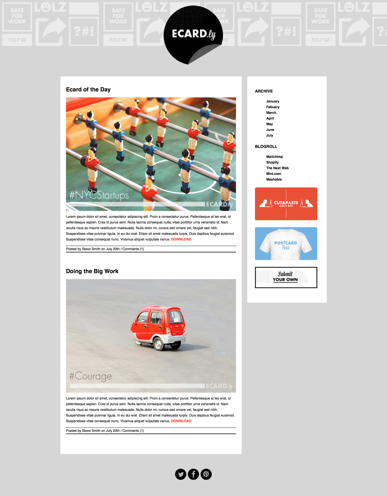
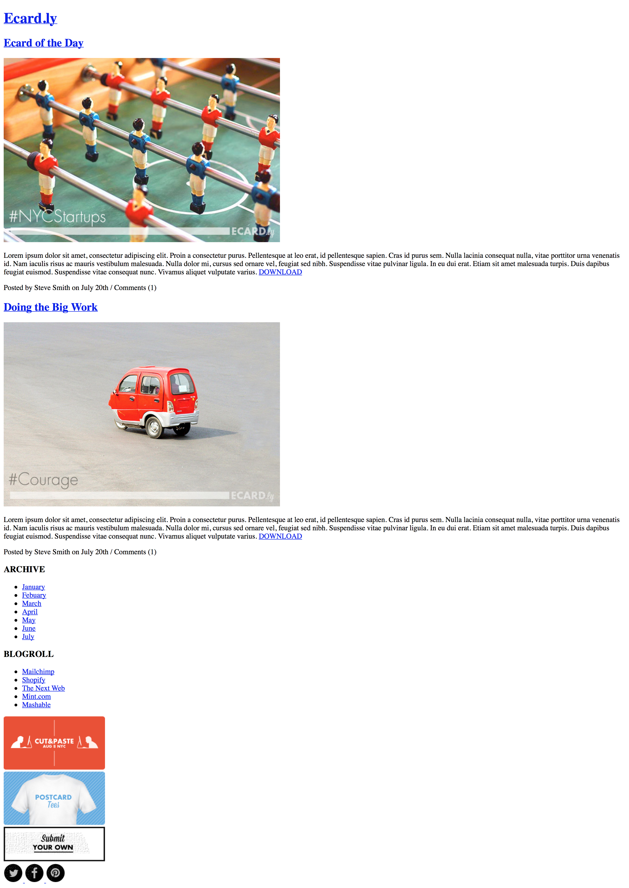

Ecardly Layout Practice
======

###Learning Objectives:

- Improve HTML skills
- Improve CSS skills

### Completion

Please finish at least the first 3 parts. As always: more is better; healthy living is best. Only do the bonus if you have completed every single part. Do not expect to get the bonus finished EVER.

###The Assignment

You've been asked to create an HTML page that matches the image files demonstrating how the page should look like, using the HTML and CSS learned in class. In the end of the homework it'll look like this:

Complete the task using the starter files provided in the `homework` directory.

### Part 1 - Laying out the Base HTML

Create an index.html file with a stylesheet linked to it. Create all your HTML elements and add images and text. Our page should look like this if we only have HTML and no CSS!

### Part 2 - Validating HTML

Validate your HTML using the [W3C validator](http://validator.w3.org/).
Make the appropriate changes until all your HTML is valid.

### Part 3 - Laying out the CSS

Now create a new css file of your naming in the `css` folder and incorporate it into your `index.html`. This is where you'll write your CSS rules to make the page resemble ( to the best of your ability ) the mockup below. There are some initial style values you can use in the `readme.html` file.

### Bonus

### Part 4

Validate your CSS using the [W3C validator](http://jigsaw.w3.org/css-validator/)
Make the appropriate changes until all your CSS is valid.

## Extra Reading

Today's a nice day, so it's advised you guys get some sun and rest, but if you want additional readings to further expand on today's lessons here are some suggested links and readings:

- [Specificity](http://www.smashingmagazine.com/2007/07/27/css-specificity-things-you-should-know/)

