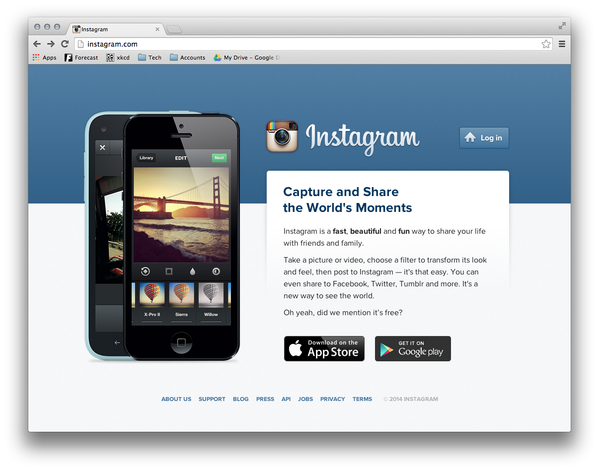

# Instagram Markup

The above image is of the Instagram Website. We are going to make a mock-up of it!

## Part 1 - HTML

Give the index.html the proper HTML structure  in order to lay out the styles.

## Part 2 - Styling

The final version we want to create will look like the below:

All of the necessary assets are included in the `/images` folder. 